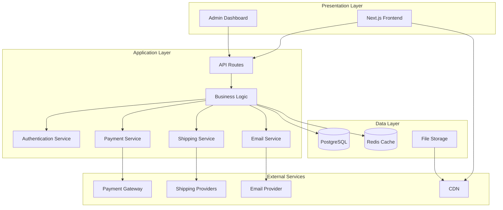

# Design Document - MyPilot 自动驾驶硬件销售网站

## Overview

MyPilot 网站采用现代化的三层架构设计，使用 Next.js 作为全栈框架，结合无头电商（Headless Commerce）理念，实现高性能、可扩展的国际化电商平台。系统设计重点关注：

- **国际化优先**：多语言、多货币、多时区支持
- **性能优化**：SSR/SSG 混合渲染、CDN 分发、图片优化
- **安全性**：端到端加密、PCI DSS 合规、安全认证
- **可扩展性**：微服务架构、API 优先设计
- **用户体验**：响应式设计、快速加载、流畅交互

技术栈选择基于现代电商最佳实践，包括 API 优先架构、事件驱动设计和组件化开发模式。

## Architecture

### High-Level Architecture

系统采用三层架构模式：



### Technology Stack

**Frontend:**
- Next.js 14+ (App Router)
- React 18+
- TypeScript
- Tailwind CSS
- Zustand (状态管理)
- React Query (数据获取)

**Backend:**
- Next.js API Routes
- Prisma ORM
- PostgreSQL 15+
- Redis (缓存和会话)

**Authentication:**
- NextAuth.js
- JWT tokens
- OAuth providers (Google, GitHub)

**Payment:**
- Stripe (信用卡、Apple Pay、Google Pay)
- PayPal
- Alipay (支付宝)

**Infrastructure:**
- Vercel (部署和 CDN)
- AWS S3 (文件存储)
- Cloudflare (DNS 和额外 CDN)

**Internationalization:**
- next-intl (i18n)
- 支持语言：en, zh-CN, zh-TW, ja, ko

**Monitoring & Analytics:**
- Vercel Analytics
- Sentry (错误追踪)
- PostHog (用户分析)

## Components and Interfaces

### Frontend Components

#### 1. Layout Components

**Header Component**
```typescript
interface HeaderProps {
  locale: string;
  currency: string;
  cartItemCount: number;
  isAuthenticated: boolean;
}

// 功能：
// - 显示 logo 和导航菜单
// - 语言/货币切换器
// - 搜索栏
// - 购物车图标（带数量徽章）
// - 用户账户菜单
```

**Footer Component**
```typescript
interface FooterProps {
  locale: string;
}

// 功能：
// - 公司信息和链接
// - 社交媒体链接
// - 支付方式图标
// - 版权信息
```

**Navigation Component**
```typescript
interface NavigationProps {
  categories: Category[];
  locale: string;
}

// 功能：
// - 产品分类菜单
// - 响应式移动菜单
// - 多级菜单支持
```

#### 2. Product Components

**ProductCard Component**
```typescript
interface ProductCardProps {
  product: {
    id: string;
    name: string;
    slug: string;
    price: number;
    currency: string;
    images: string[];
    rating: number;
    reviewCount: number;
    inStock: boolean;
  };
  locale: string;
}

// 功能：
// - 显示产品缩略图
// - 产品名称和价格
// - 评分和评论数
// - 库存状态
// - 快速添加到购物车按钮
```

**ProductDetail Component**
```typescript
interface ProductDetailProps {
  product: Product;
  reviews: Review[];
  relatedProducts: Product[];
  locale: string;
  currency: string;
}

// 功能：
// - 产品图片画廊（支持缩放）
// - 产品规格和描述
// - 价格和库存信息
// - 数量选择器
// - 添加到购物车按钮
// - 产品评价列表
// - 相关产品推荐
```

**ProductGallery Component**
```typescript
interface ProductGalleryProps {
  images: string[];
  alt: string;
}

// 功能：
// - 主图显示
// - 缩略图导航
// - 图片缩放功能
// - 触摸滑动支持
```

#### 3. Cart Components

**CartDrawer Component**
```typescript
interface CartDrawerProps {
  isOpen: boolean;
  onClose: () => void;
  items: CartItem[];
  total: number;
  currency: string;
}

// 功能：
// - 侧边栏购物车
// - 显示所有购物车项目
// - 更新数量
// - 删除项目
// - 显示小计
// - 前往结账按钮
```

**CartItem Component**
```typescript
interface CartItemProps {
  item: {
    id: string;
    productId: string;
    name: string;
    image: string;
    price: number;
    quantity: number;
    maxQuantity: number;
  };
  currency: string;
  onUpdateQuantity: (id: string, quantity: number) => void;
  onRemove: (id: string) => void;
}

// 功能：
// - 显示产品信息
// - 数量调整器
// - 删除按钮
// - 小计计算
```

#### 4. Checkout Components

**CheckoutForm Component**
```typescript
interface CheckoutFormProps {
  cart: Cart;
  user: User | null;
  onSubmit: (data: CheckoutData) => Promise<void>;
}

// 功能：
// - 配送地址表单
// - 配送方式选择
// - 支付方式选择
// - 订单摘要
// - 提交订单
```

**AddressForm Component**
```typescript
interface AddressFormProps {
  initialAddress?: Address;
  onSubmit: (address: Address) => void;
  countries: Country[];
}

// 功能：
// - 地址输入表单
// - 国家/地区选择
// - 地址验证
// - 保存地址选项
```

**PaymentForm Component**
```typescript
interface PaymentFormProps {
  amount: number;
  currency: string;
  onSuccess: (paymentId: string) => void;
  onError: (error: Error) => void;
}

// 功能：
// - Stripe Elements 集成
// - 信用卡输入
// - PayPal 按钮
// - Alipay 按钮
// - 支付处理状态
```

#### 5. User Account Components

**AccountDashboard Component**
```typescript
interface AccountDashboardProps {
  user: User;
  orders: Order[];
  addresses: Address[];
}

// 功能：
// - 用户信息概览
// - 最近订单
// - 保存的地址
// - 账户设置链接
```

**OrderHistory Component**
```typescript
interface OrderHistoryProps {
  orders: Order[];
  locale: string;
  currency: string;
}

// 功能：
// - 订单列表
// - 订单状态
// - 订单详情链接
// - 追踪链接
```

**OrderDetail Component**
```typescript
interface OrderDetailProps {
  order: Order;
  locale: string;
  currency: string;
}

// 功能：
// - 订单信息
// - 订单项目列表
// - 配送地址
// - 追踪信息
// - 发票下载
```

#### 6. Review Components

**ReviewList Component**
```typescript
interface ReviewListProps {
  reviews: Review[];
  averageRating: number;
  totalReviews: number;
}

// 功能：
// - 评分统计
// - 评论列表
// - 分页
// - 排序选项
```

**ReviewForm Component**
```typescript
interface ReviewFormProps {
  productId: string;
  onSubmit: (review: ReviewInput) => Promise<void>;
}

// 功能：
// - 星级评分选择器
// - 评论文本输入
// - 图片上传（可选）
// - 提交按钮
```

### Backend API Endpoints

#### Product APIs

```typescript
// GET /api/products
// 获取产品列表（支持分页、筛选、排序）
interface GetProductsQuery {
  page?: number;
  limit?: number;
  category?: string;
  minPrice?: number;
  maxPrice?: number;
  sortBy?: 'price' | 'rating' | 'newest';
  search?: string;
}

// GET /api/products/[slug]
// 获取单个产品详情

// POST /api/products (Admin only)
// 创建新产品

// PUT /api/products/[id] (Admin only)
// 更新产品

// DELETE /api/products/[id] (Admin only)
// 删除产品
```

#### Cart APIs

```typescript
// GET /api/cart
// 获取当前用户购物车

// POST /api/cart/items
// 添加商品到购物车
interface AddToCartInput {
  productId: string;
  quantity: number;
}

// PUT /api/cart/items/[id]
// 更新购物车商品数量
interface UpdateCartItemInput {
  quantity: number;
}

// DELETE /api/cart/items/[id]
// 从购物车删除商品

// DELETE /api/cart
// 清空购物车
```

#### Order APIs

```typescript
// POST /api/orders
// 创建订单
interface CreateOrderInput {
  cartId: string;
  shippingAddressId: string;
  shippingMethodId: string;
  paymentMethodId: string;
}

// GET /api/orders
// 获取用户订单列表

// GET /api/orders/[id]
// 获取订单详情

// POST /api/orders/[id]/cancel
// 取消订单

// GET /api/orders/[id]/tracking
// 获取订单追踪信息
```

#### User APIs

```typescript
// POST /api/auth/register
// 用户注册
interface RegisterInput {
  email: string;
  password: string;
  name: string;
}

// POST /api/auth/login
// 用户登录

// POST /api/auth/logout
// 用户登出

// GET /api/user/profile
// 获取用户资料

// PUT /api/user/profile
// 更新用户资料

// GET /api/user/addresses
// 获取用户地址列表

// POST /api/user/addresses
// 添加新地址

// PUT /api/user/addresses/[id]
// 更新地址

// DELETE /api/user/addresses/[id]
// 删除地址
```

#### Payment APIs

```typescript
// POST /api/payment/create-intent
// 创建支付意图（Stripe）
interface CreatePaymentIntentInput {
  amount: number;
  currency: string;
  orderId: string;
}

// POST /api/payment/confirm
// 确认支付

// POST /api/payment/webhook
// 支付网关 webhook
```

#### Review APIs

```typescript
// GET /api/products/[id]/reviews
// 获取产品评论

// POST /api/reviews
// 创建评论
interface CreateReviewInput {
  productId: string;
  rating: number;
  comment: string;
  images?: string[];
}

// PUT /api/reviews/[id]
// 更新评论

// DELETE /api/reviews/[id]
// 删除评论
```

#### Admin APIs

```typescript
// GET /api/admin/dashboard
// 获取仪表板数据

// GET /api/admin/orders
// 获取所有订单

// PUT /api/admin/orders/[id]/status
// 更新订单状态

// GET /api/admin/inventory
// 获取库存信息

// PUT /api/admin/inventory/[productId]
// 更新库存
```

## Data Models

### Database Schema

```prisma
// User Model
model User {
  id            String    @id @default(cuid())
  email         String    @unique
  name          String
  password      String
  emailVerified DateTime?
  image         String?
  role          Role      @default(CUSTOMER)
  createdAt     DateTime  @default(now())
  updatedAt     DateTime  @updatedAt
  
  addresses     Address[]
  orders        Order[]
  reviews       Review[]
  cart          Cart?
}

enum Role {
  CUSTOMER
  ADMIN
}

// Address Model
model Address {
  id          String  @id @default(cuid())
  userId      String
  name        String
  phone       String
  line1       String
  line2       String?
  city        String
  state       String
  postalCode  String
  country     String
  isDefault   Boolean @default(false)
  
  user        User    @relation(fields: [userId], references: [id], onDelete: Cascade)
  orders      Order[]
  
  @@index([userId])
}

// Product Model
model Product {
  id          String   @id @default(cuid())
  slug        String   @unique
  sku         String   @unique
  name        String
  description String   @db.Text
  price       Decimal  @db.Decimal(10, 2)
  comparePrice Decimal? @db.Decimal(10, 2)
  costPrice   Decimal? @db.Decimal(10, 2)
  inventory   Int      @default(0)
  lowStockThreshold Int @default(10)
  weight      Decimal? @db.Decimal(10, 2)
  images      String[]
  published   Boolean  @default(false)
  featured    Boolean  @default(false)
  categoryId  String
  createdAt   DateTime @default(now())
  updatedAt   DateTime @updatedAt
  
  category    Category @relation(fields: [categoryId], references: [id])
  cartItems   CartItem[]
  orderItems  OrderItem[]
  reviews     Review[]
  translations ProductTranslation[]
  
  @@index([categoryId])
  @@index([slug])
  @@index([published])
}

// ProductTranslation Model
model ProductTranslation {
  id          String  @id @default(cuid())
  productId   String
  locale      String
  name        String
  description String  @db.Text
  
  product     Product @relation(fields: [productId], references: [id], onDelete: Cascade)
  
  @@unique([productId, locale])
  @@index([productId])
}

// Category Model
model Category {
  id          String   @id @default(cuid())
  slug        String   @unique
  name        String
  description String?
  image       String?
  parentId    String?
  order       Int      @default(0)
  
  parent      Category?  @relation("CategoryToCategory", fields: [parentId], references: [id])
  children    Category[] @relation("CategoryToCategory")
  products    Product[]
  translations CategoryTranslation[]
  
  @@index([parentId])
  @@index([slug])
}

// CategoryTranslation Model
model CategoryTranslation {
  id          String   @id @default(cuid())
  categoryId  String
  locale      String
  name        String
  description String?
  
  category    Category @relation(fields: [categoryId], references: [id], onDelete: Cascade)
  
  @@unique([categoryId, locale])
  @@index([categoryId])
}

// Cart Model
model Cart {
  id        String     @id @default(cuid())
  userId    String?    @unique
  sessionId String?    @unique
  createdAt DateTime   @default(now())
  updatedAt DateTime   @updatedAt
  
  user      User?      @relation(fields: [userId], references: [id], onDelete: Cascade)
  items     CartItem[]
}

// CartItem Model
model CartItem {
  id        String   @id @default(cuid())
  cartId    String
  productId String
  quantity  Int
  createdAt DateTime @default(now())
  updatedAt DateTime @updatedAt
  
  cart      Cart     @relation(fields: [cartId], references: [id], onDelete: Cascade)
  product   Product  @relation(fields: [productId], references: [id])
  
  @@unique([cartId, productId])
  @@index([cartId])
  @@index([productId])
}

// Order Model
model Order {
  id              String      @id @default(cuid())
  orderNumber     String      @unique
  userId          String
  status          OrderStatus @default(PENDING)
  subtotal        Decimal     @db.Decimal(10, 2)
  shippingCost    Decimal     @db.Decimal(10, 2)
  tax             Decimal     @db.Decimal(10, 2)
  total           Decimal     @db.Decimal(10, 2)
  currency        String      @default("USD")
  shippingAddressId String
  shippingMethod  String
  trackingNumber  String?
  trackingUrl     String?
  paymentMethod   String
  paymentId       String?
  paymentStatus   PaymentStatus @default(PENDING)
  notes           String?
  createdAt       DateTime    @default(now())
  updatedAt       DateTime    @updatedAt
  
  user            User        @relation(fields: [userId], references: [id])
  shippingAddress Address     @relation(fields: [shippingAddressId], references: [id])
  items           OrderItem[]
  
  @@index([userId])
  @@index([orderNumber])
  @@index([status])
}

enum OrderStatus {
  PENDING
  PROCESSING
  SHIPPED
  DELIVERED
  CANCELLED
  REFUNDED
}

enum PaymentStatus {
  PENDING
  PAID
  FAILED
  REFUNDED
}

// OrderItem Model
model OrderItem {
  id        String  @id @default(cuid())
  orderId   String
  productId String
  name      String
  sku       String
  price     Decimal @db.Decimal(10, 2)
  quantity  Int
  
  order     Order   @relation(fields: [orderId], references: [id], onDelete: Cascade)
  product   Product @relation(fields: [productId], references: [id])
  
  @@index([orderId])
  @@index([productId])
}

// Review Model
model Review {
  id        String   @id @default(cuid())
  userId    String
  productId String
  rating    Int
  comment   String?  @db.Text
  images    String[]
  verified  Boolean  @default(false)
  approved  Boolean  @default(true)
  createdAt DateTime @default(now())
  updatedAt DateTime @updatedAt
  
  user      User     @relation(fields: [userId], references: [id], onDelete: Cascade)
  product   Product  @relation(fields: [productId], references: [id], onDelete: Cascade)
  
  @@unique([userId, productId])
  @@index([productId])
  @@index([approved])
}

// ShippingRate Model
model ShippingRate {
  id          String  @id @default(cuid())
  name        String
  description String?
  country     String
  minWeight   Decimal @db.Decimal(10, 2)
  maxWeight   Decimal @db.Decimal(10, 2)
  price       Decimal @db.Decimal(10, 2)
  currency    String  @default("USD")
  estimatedDays Int
  active      Boolean @default(true)
  
  @@index([country])
  @@index([active])
}
```

### Redis Cache Structure

```typescript
// 缓存键命名约定
const CACHE_KEYS = {
  // 产品缓存 (TTL: 1 hour)
  PRODUCT: (id: string) => `product:${id}`,
  PRODUCTS_LIST: (params: string) => `products:list:${params}`,
  
  // 分类缓存 (TTL: 6 hours)
  CATEGORY: (id: string) => `category:${id}`,
  CATEGORIES_TREE: 'categories:tree',
  
  // 购物车缓存 (TTL: 7 days)
  CART: (userId: string) => `cart:${userId}`,
  CART_SESSION: (sessionId: string) => `cart:session:${sessionId}`,
  
  // 用户会话 (TTL: 30 days)
  SESSION: (token: string) => `session:${token}`,
  
  // 汇率缓存 (TTL: 1 hour)
  EXCHANGE_RATES: 'exchange:rates',
  
  // 库存缓存 (TTL: 5 minutes)
  INVENTORY: (productId: string) => `inventory:${productId}`,
};
```

## Correctness Properties

*属性（Property）是系统在所有有效执行中都应该保持为真的特征或行为——本质上是关于系统应该做什么的形式化陈述。属性是人类可读规范和机器可验证正确性保证之间的桥梁。*

### Product and Catalog Properties

**Property 1: Category Filtering Correctness**
*For any* product category and product set, when filtering products by category, all returned products should belong to that category and no products from that category should be missing.
**Validates: Requirements 1.2**

**Property 2: Product Search Relevance**
*For any* search query, all returned products should match the query in their name, description, or specifications.
**Validates: Requirements 1.4**

**Property 3: Currency Display Consistency**
*For any* product and selected currency, the displayed price should be correctly converted to that currency using current exchange rates, and all prices on the page should use the same currency.
**Validates: Requirements 1.5, 5.8**

### Internationalization Properties

**Property 4: Language Translation Completeness**
*For any* UI element and supported language, when that language is selected, the UI element should display text in that language (or fall back to English if translation is unavailable).
**Validates: Requirements 2.2**

**Property 5: Language Preference Persistence**
*For any* user and language selection, after setting a language preference and ending the session, starting a new session should preserve that language preference.
**Validates: Requirements 2.4**

### Shopping Cart Properties

**Property 6: Cart Total Calculation**
*For any* cart state and cart operation (add, update, remove), the cart total should always equal the sum of (price × quantity) for all items in the cart.
**Validates: Requirements 3.1, 3.3, 3.4**

**Property 7: Cart Item Display Completeness**
*For any* cart with items, the cart view should display all items with their product details, quantities, and subtotals.
**Validates: Requirements 3.2**

**Property 8: Cart Persistence for Registered Users**
*For any* registered customer and cart contents, after adding items to cart and ending the session, starting a new session should preserve all cart contents.
**Validates: Requirements 3.5**

### User Authentication Properties

**Property 9: Valid Registration Creates Account**
*For any* valid registration data (unique email, valid password, valid name), submitting registration should create a new customer account that can be used for authentication.
**Validates: Requirements 4.1**

**Property 10: Invalid Registration Rejected**
*For any* invalid registration data (duplicate email, weak password, missing fields), submitting registration should be rejected with specific validation errors.
**Validates: Requirements 4.2**

**Property 11: Valid Credentials Authenticate**
*For any* existing customer account and correct credentials, authentication should succeed and grant access to the account.
**Validates: Requirements 4.3**

**Property 12: Profile Update Persistence**
*For any* customer and profile updates (name, email, password), after updating profile information, the changes should be persisted and reflected in subsequent profile retrievals.
**Validates: Requirements 4.5**

**Property 13: Multiple Address Management**
*For any* customer, the system should allow saving multiple shipping addresses, and all saved addresses should be retrievable.
**Validates: Requirements 4.6**

### Order and Payment Properties

**Property 14: Checkout Summary Completeness**
*For any* cart proceeding to checkout, the order summary should display all cart items with their quantities, prices, and the correct total amount.
**Validates: Requirements 5.1**

**Property 15: Shipping Cost Calculation**
*For any* shipping address and order, the calculated shipping cost should be based on the destination country and total order weight according to shipping rate rules.
**Validates: Requirements 5.2**

**Property 16: Successful Payment Creates Order**
*For any* successful payment, the system should create an order record with all cart items and send a confirmation email to the customer.
**Validates: Requirements 5.5**

### Order Management Properties

**Property 17: Order Information Completeness**
*For any* customer order, the order detail view should display all order items, quantities, prices, shipping address, and tracking information (if available).
**Validates: Requirements 6.1, 6.2**

**Property 18: Order Status Change Notification**
*For any* order status change, the system should send a notification email to the customer.
**Validates: Requirements 6.3**

**Property 19: Unshipped Order Cancellation**
*For any* order, if the order status is not "SHIPPED" or "DELIVERED", the customer should be able to cancel it; otherwise, cancellation should be rejected.
**Validates: Requirements 6.5**

### Inventory Management Properties

**Property 20: Inventory Update Persistence**
*For any* product and inventory update by admin, the new inventory quantity should be immediately persisted and reflected in subsequent inventory queries.
**Validates: Requirements 7.1**

**Property 21: Order Placement Decreases Inventory**
*For any* product and order placement, the product inventory should decrease by the ordered quantity.
**Validates: Requirements 7.2**

**Property 22: Order Cancellation Restores Inventory (Round-trip)**
*For any* product and order, placing an order then cancelling it should restore the inventory to its original quantity.
**Validates: Requirements 7.3**

**Property 23: Inventory Validation Prevents Overselling**
*For any* product and order quantity, if the quantity exceeds available inventory, the order should be rejected.
**Validates: Requirements 7.5**

**Property 24: Concurrent Purchase Atomicity**
*For any* product with limited inventory, when multiple customers attempt to purchase simultaneously, the total quantity sold should not exceed available inventory.
**Validates: Requirements 7.6**

### Review System Properties

**Property 25: Review Permission Validation**
*For any* customer and product, the customer should only be able to submit a review if they have purchased that product.
**Validates: Requirements 8.1**

**Property 26: Review Validation Requirements**
*For any* review submission, the review must include a rating between 1-5 stars, and may optionally include a text comment.
**Validates: Requirements 8.2**

**Property 27: Approved Reviews Display**
*For any* product, the product page should display all approved reviews with ratings, comments, reviewer names, and dates, and should not display unapproved reviews.
**Validates: Requirements 8.3**

**Property 28: Average Rating Calculation**
*For any* product with reviews, the displayed average rating should equal the mean of all approved review ratings for that product.
**Validates: Requirements 8.4**

**Property 29: Review Uniqueness**
*For any* customer and product, attempting to submit multiple reviews for the same product should be rejected after the first review is submitted.
**Validates: Requirements 8.6**

### Shipping Properties

**Property 30: Shipping Cost Calculation for All Methods**
*For any* shipping address, the system should calculate and display shipping costs for all available shipping methods based on the destination.
**Validates: Requirements 9.2**

**Property 31: Tracking Number Generation**
*For any* order that is marked as shipped, the system should generate a tracking number and send it to the customer.
**Validates: Requirements 9.4**

**Property 32: Shipping Address Validation**
*For any* shipping address input, the system should validate that the address is deliverable before allowing it to be used for an order.
**Validates: Requirements 9.5**

### Admin Management Properties

**Property 33: Product CRUD Operations**
*For any* admin user, the system should allow creating, updating, and deleting product records, and changes should be immediately visible on the public website.
**Validates: Requirements 10.2, 10.7**

**Property 34: Order Status Management**
*For any* admin user and order, the admin should be able to view and update the order status.
**Validates: Requirements 10.3**

**Property 35: Category Management**
*For any* admin user, the system should allow creating, updating, and deleting product categories.
**Validates: Requirements 10.5**

**Property 36: Sales Report Filtering**
*For any* date range, product, or region filter, the sales report should include only orders matching the filter criteria.
**Validates: Requirements 10.6**

### Security Properties

**Property 37: Sensitive Data Encryption**
*For any* sensitive data (passwords, payment information), the data should be encrypted before storage and never stored in plain text.
**Validates: Requirements 12.1**

**Property 38: Payment Data Non-Storage**
*For any* payment transaction, credit card details should never be stored in the system database and should be transmitted directly to the payment gateway.
**Validates: Requirements 12.3**

**Property 39: Rate Limiting Enforcement**
*For any* authentication endpoint, after a threshold number of failed attempts from the same IP or user, subsequent requests should be rate-limited or blocked temporarily.
**Validates: Requirements 12.4**

**Property 40: Security Event Logging**
*For any* security-relevant event (login, logout, failed authentication, password change, admin action), the event should be logged with timestamp, user, and action details.
**Validates: Requirements 12.5**

### SEO Properties

**Property 41: Product Page Meta Tags**
*For any* product page, the HTML should include meta description and Open Graph tags with product information.
**Validates: Requirements 13.2**

**Property 42: Structured Data Markup**
*For any* product page, the HTML should include Schema.org structured data markup for the product.
**Validates: Requirements 13.4**

**Property 43: SEO-Friendly URL Generation**
*For any* page, the URL should follow SEO best practices (lowercase, hyphens for spaces, no special characters, descriptive slugs).
**Validates: Requirements 13.5**

## Error Handling

### Error Classification

系统采用分层错误处理策略，将错误分为以下类别：

#### 1. Validation Errors (400)
- 用户输入验证失败
- 格式错误（邮箱、电话号码等）
- 必填字段缺失
- 数据类型不匹配

**处理策略：**
- 返回详细的字段级错误信息
- 前端显示内联错误提示
- 不记录到错误日志（正常业务流程）

#### 2. Authentication Errors (401)
- 未登录访问受保护资源
- Token 过期或无效
- 凭证错误

**处理策略：**
- 重定向到登录页面
- 清除无效 token
- 记录失败尝试（安全审计）

#### 3. Authorization Errors (403)
- 权限不足
- 访问其他用户资源
- 非管理员访问管理功能

**处理策略：**
- 返回权限不足提示
- 记录未授权访问尝试
- 不泄露资源是否存在

#### 4. Not Found Errors (404)
- 资源不存在
- 无效的产品 ID/slug
- 页面不存在

**处理策略：**
- 显示友好的 404 页面
- 提供搜索或导航建议
- 不记录到错误日志

#### 5. Business Logic Errors (422)
- 库存不足
- 订单无法取消（已发货）
- 重复评论
- 并发冲突

**处理策略：**
- 返回具体的业务错误信息
- 提供可能的解决方案
- 记录到业务日志

#### 6. External Service Errors (502/503)
- 支付网关失败
- 物流 API 超时
- 邮件服务不可用
- 汇率 API 失败

**处理策略：**
- 实现重试机制（指数退避）
- 使用降级方案（缓存汇率）
- 异步处理（邮件队列）
- 记录到错误日志并告警

#### 7. Server Errors (500)
- 未捕获的异常
- 数据库连接失败
- 内存溢出
- 代码错误

**处理策略：**
- 返回通用错误信息（不泄露内部细节）
- 记录完整错误堆栈到 Sentry
- 立即告警通知开发团队
- 显示友好的错误页面

### Error Response Format

所有 API 错误响应遵循统一格式：

```typescript
interface ErrorResponse {
  error: {
    code: string;           // 错误代码（如 INVALID_EMAIL）
    message: string;        // 用户友好的错误信息
    details?: {             // 可选的详细信息
      field?: string;       // 相关字段
      value?: any;          // 导致错误的值
      constraint?: string;  // 违反的约束
    }[];
    requestId: string;      // 请求 ID（用于追踪）
    timestamp: string;      // 错误发生时间
  };
}
```

### Error Handling Patterns

#### Frontend Error Handling

```typescript
// API 调用错误处理
async function handleApiCall<T>(
  apiCall: () => Promise<T>
): Promise<Result<T, ErrorResponse>> {
  try {
    const data = await apiCall();
    return { success: true, data };
  } catch (error) {
    if (error instanceof ApiError) {
      // 显示用户友好的错误信息
      toast.error(error.message);
      return { success: false, error: error.response };
    }
    
    // 未知错误
    toast.error('发生了意外错误，请稍后重试');
    Sentry.captureException(error);
    return { 
      success: false, 
      error: { 
        code: 'UNKNOWN_ERROR', 
        message: '发生了意外错误' 
      } 
    };
  }
}
```

#### Backend Error Handling

```typescript
// API Route 错误处理中间件
export function errorHandler(
  error: Error,
  req: NextRequest
): NextResponse {
  // 记录错误
  logger.error('API Error', {
    error: error.message,
    stack: error.stack,
    path: req.url,
    method: req.method,
    requestId: req.headers.get('x-request-id'),
  });
  
  // 根据错误类型返回适当的响应
  if (error instanceof ValidationError) {
    return NextResponse.json(
      { error: error.toJSON() },
      { status: 400 }
    );
  }
  
  if (error instanceof AuthenticationError) {
    return NextResponse.json(
      { error: error.toJSON() },
      { status: 401 }
    );
  }
  
  // 默认服务器错误
  return NextResponse.json(
    { 
      error: {
        code: 'INTERNAL_SERVER_ERROR',
        message: '服务器内部错误',
        requestId: req.headers.get('x-request-id'),
      }
    },
    { status: 500 }
  );
}
```

### Retry and Fallback Strategies

#### Payment Processing
- 最多重试 3 次
- 每次重试间隔：1s, 2s, 4s（指数退避）
- 失败后保存订单为 PENDING 状态
- 允许用户稍后重新支付

#### Email Sending
- 使用消息队列异步发送
- 失败后自动重试（最多 5 次）
- 24 小时后仍失败则记录并告警
- 不阻塞主业务流程

#### External API Calls
- 设置合理的超时时间（5-10 秒）
- 实现断路器模式
- 使用缓存作为降级方案
- 记录失败率并监控

## Testing Strategy

### Testing Approach

系统采用双重测试策略，结合单元测试和基于属性的测试（Property-Based Testing）：

- **单元测试**：验证具体示例、边界情况和错误条件
- **属性测试**：验证跨所有输入的通用属性
- 两者互补，共同确保全面覆盖

### Testing Framework

**Property-Based Testing Library:**
- 使用 **fast-check** 进行属性测试（JavaScript/TypeScript 的 PBT 库）
- 每个属性测试运行最少 100 次迭代
- 使用随机生成的输入数据

**Unit Testing Framework:**
- Jest（测试运行器和断言库）
- React Testing Library（组件测试）
- Supertest（API 测试）

### Test Organization

```
tests/
├── unit/                    # 单元测试
│   ├── components/         # React 组件测试
│   ├── api/               # API 路由测试
│   ├── lib/               # 工具函数测试
│   └── services/          # 服务层测试
├── properties/             # 属性测试
│   ├── cart.properties.test.ts
│   ├── inventory.properties.test.ts
│   ├── order.properties.test.ts
│   └── ...
├── integration/            # 集成测试
│   ├── checkout-flow.test.ts
│   └── order-lifecycle.test.ts
└── e2e/                    # 端到端测试（可选）
    └── critical-paths.spec.ts
```

### Property Test Configuration

每个属性测试必须：
1. 运行最少 100 次迭代
2. 使用注释标记引用设计文档中的属性
3. 使用 fast-check 生成随机测试数据

**标记格式：**
```typescript
/**
 * Feature: mypilot-website
 * Property 6: Cart Total Calculation
 * 
 * For any cart state and cart operation (add, update, remove), 
 * the cart total should always equal the sum of (price × quantity) 
 * for all items in the cart.
 */
```

### Property Test Examples

#### Example 1: Cart Total Calculation

```typescript
import fc from 'fast-check';
import { calculateCartTotal } from '@/lib/cart';

/**
 * Feature: mypilot-website
 * Property 6: Cart Total Calculation
 */
describe('Property 6: Cart Total Calculation', () => {
  it('cart total equals sum of (price × quantity) after any operation', () => {
    fc.assert(
      fc.property(
        fc.array(fc.record({
          id: fc.uuid(),
          price: fc.float({ min: 0.01, max: 10000, noNaN: true }),
          quantity: fc.integer({ min: 1, max: 100 }),
        })),
        (items) => {
          const cart = { items };
          const total = calculateCartTotal(cart);
          const expectedTotal = items.reduce(
            (sum, item) => sum + item.price * item.quantity,
            0
          );
          
          expect(total).toBeCloseTo(expectedTotal, 2);
        }
      ),
      { numRuns: 100 }
    );
  });
});
```

#### Example 2: Inventory Round-trip

```typescript
/**
 * Feature: mypilot-website
 * Property 22: Order Cancellation Restores Inventory (Round-trip)
 */
describe('Property 22: Inventory Round-trip', () => {
  it('placing then cancelling order restores inventory', async () => {
    await fc.assert(
      fc.asyncProperty(
        fc.record({
          productId: fc.uuid(),
          initialInventory: fc.integer({ min: 10, max: 1000 }),
          orderQuantity: fc.integer({ min: 1, max: 10 }),
        }),
        async ({ productId, initialInventory, orderQuantity }) => {
          // Setup: Set initial inventory
          await setInventory(productId, initialInventory);
          
          // Action: Place order
          const order = await placeOrder({
            items: [{ productId, quantity: orderQuantity }]
          });
          
          // Verify: Inventory decreased
          const afterOrder = await getInventory(productId);
          expect(afterOrder).toBe(initialInventory - orderQuantity);
          
          // Action: Cancel order
          await cancelOrder(order.id);
          
          // Verify: Inventory restored
          const afterCancel = await getInventory(productId);
          expect(afterCancel).toBe(initialInventory);
        }
      ),
      { numRuns: 100 }
    );
  });
});
```

#### Example 3: Currency Conversion

```typescript
/**
 * Feature: mypilot-website
 * Property 3: Currency Display Consistency
 */
describe('Property 3: Currency Display Consistency', () => {
  it('all prices use selected currency with correct conversion', () => {
    fc.assert(
      fc.property(
        fc.array(fc.record({
          id: fc.uuid(),
          priceUSD: fc.float({ min: 1, max: 10000, noNaN: true }),
        })),
        fc.constantFrom('USD', 'EUR', 'CNY', 'JPY', 'KRW'),
        (products, targetCurrency) => {
          const rates = getExchangeRates();
          const displayedProducts = products.map(p => 
            convertPrice(p, targetCurrency, rates)
          );
          
          // All products should use target currency
          displayedProducts.forEach(p => {
            expect(p.currency).toBe(targetCurrency);
            
            // Conversion should be correct
            const expectedPrice = p.priceUSD * rates[targetCurrency];
            expect(p.displayPrice).toBeCloseTo(expectedPrice, 2);
          });
        }
      ),
      { numRuns: 100 }
    );
  });
});
```

### Unit Test Examples

单元测试关注具体示例和边界情况：

```typescript
describe('Cart Operations', () => {
  it('should add product to empty cart', () => {
    const cart = createEmptyCart();
    const product = { id: '1', price: 99.99, name: 'Product' };
    
    const updated = addToCart(cart, product, 1);
    
    expect(updated.items).toHaveLength(1);
    expect(updated.items[0].productId).toBe('1');
    expect(updated.items[0].quantity).toBe(1);
  });
  
  it('should reject adding quantity exceeding inventory', () => {
    const cart = createEmptyCart();
    const product = { id: '1', price: 99.99, inventory: 5 };
    
    expect(() => {
      addToCart(cart, product, 10);
    }).toThrow('Quantity exceeds available inventory');
  });
  
  it('should handle empty cart total calculation', () => {
    const cart = createEmptyCart();
    expect(calculateCartTotal(cart)).toBe(0);
  });
});
```

### Integration Test Strategy

集成测试验证多个组件协同工作：

```typescript
describe('Checkout Flow Integration', () => {
  it('should complete full checkout process', async () => {
    // 1. Create user and login
    const user = await createTestUser();
    const session = await login(user.email, user.password);
    
    // 2. Add products to cart
    await addToCart(session, testProduct1, 2);
    await addToCart(session, testProduct2, 1);
    
    // 3. Proceed to checkout
    const checkout = await initiateCheckout(session);
    expect(checkout.items).toHaveLength(2);
    
    // 4. Add shipping address
    await setShippingAddress(session, testAddress);
    
    // 5. Process payment
    const payment = await processPayment(session, testPaymentMethod);
    expect(payment.status).toBe('succeeded');
    
    // 6. Verify order created
    const order = await getOrder(payment.orderId);
    expect(order.status).toBe('PROCESSING');
    expect(order.items).toHaveLength(2);
    
    // 7. Verify inventory decreased
    const inventory1 = await getInventory(testProduct1.id);
    expect(inventory1).toBe(testProduct1.inventory - 2);
  });
});
```

### Test Coverage Goals

- **单元测试覆盖率**：> 80%
- **属性测试**：每个设计属性至少一个测试
- **集成测试**：覆盖所有关键业务流程
- **边界情况**：所有已知边界情况都有单元测试

### Testing Best Practices

1. **属性测试优先**：对于通用规则，优先编写属性测试
2. **单元测试补充**：用单元测试覆盖具体示例和边界情况
3. **避免过多单元测试**：属性测试已经覆盖了大量输入组合
4. **测试隔离**：每个测试独立运行，不依赖其他测试
5. **使用测试数据生成器**：为属性测试创建可重用的数据生成器
6. **快速反馈**：单元测试应该快速运行（< 5 秒）
7. **清晰的测试名称**：测试名称应该描述被测试的行为

### Continuous Integration

- 所有测试在 PR 合并前必须通过
- 属性测试在 CI 中运行 100 次迭代
- 失败的属性测试应该显示导致失败的反例
- 代码覆盖率报告自动生成并审查

